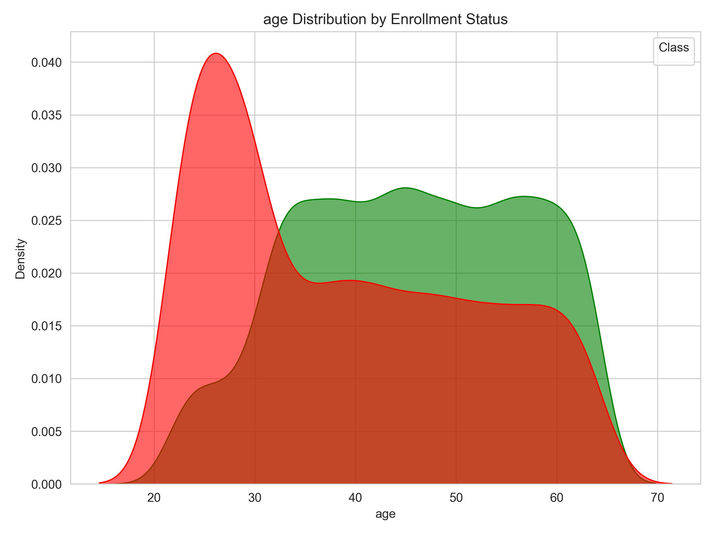
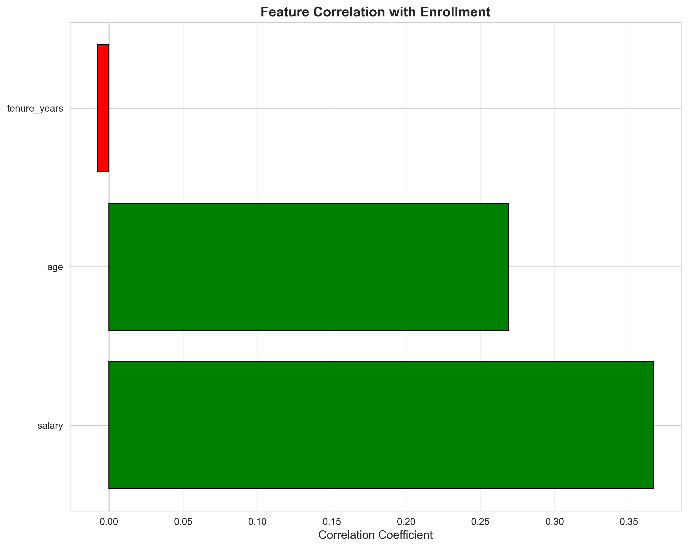
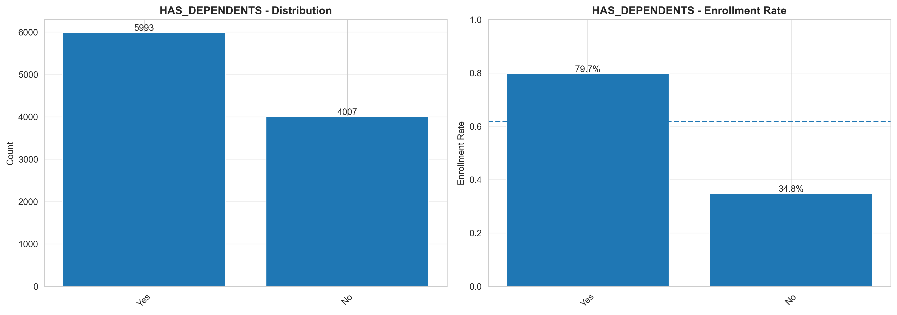
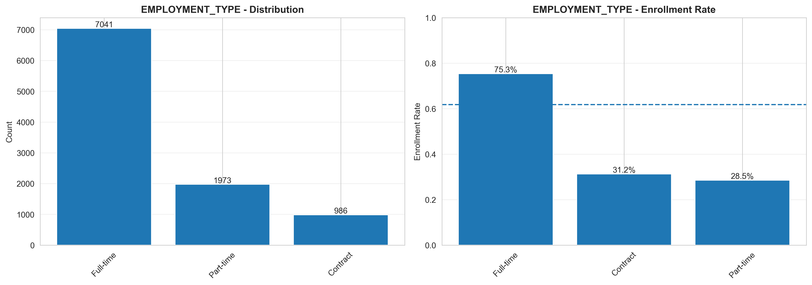
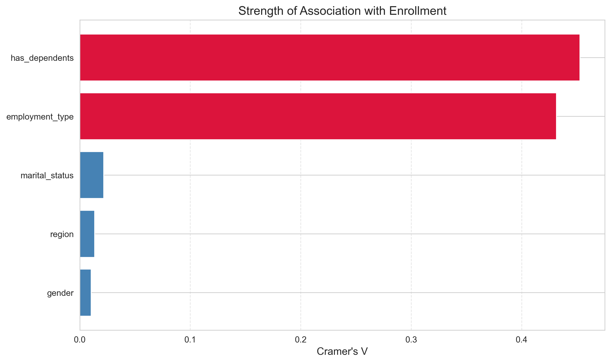
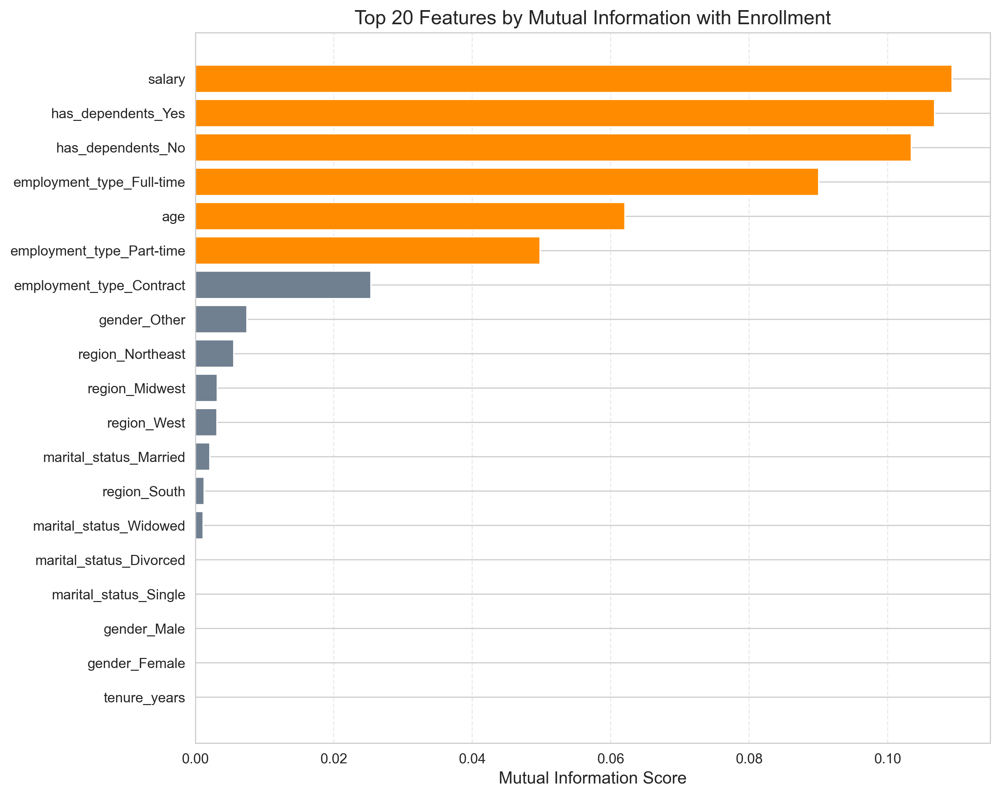

# Insurance Enrollment Prediction Project Report

## Project Overview

This project focuses on predicting whether employees will enroll in an insurance plan based on their demographic and employment information. The goal was to build a reliable machine learning model that could help the HR team identify employees likely to enroll, enabling better resource planning and targeted outreach.

The dataset contains 10,000 employee records with 10 features including age, salary, tenure, employment type, and other demographic information. The target variable is binary: 1 for enrolled and 0 for not enrolled.

---

## Exploratory Data Analysis

### Data Quality Assessment

Before diving into the analysis, I checked the data for any quality issues. The dataset turned out to be pretty clean with no missing values and zero duplicate rows. This saved a lot of preprocessing time and meant I could focus directly on understanding the relationships in the data.

The dataset has a slight class imbalance with 61.74% of employees enrolled and 38.26% not enrolled. It's not severe enough to require special handling, but I kept this in mind when evaluating model performance.

### Numerical Features Analysis

I analyzed the three numerical features: Age, Salary, and Tenure Years.

**Salary** showed the strongest relationship with enrollment. Employees who enrolled had an average salary of around $69,337 compared to $58,087 for those who didn't enroll. The correlation coefficient of 0.37 indicates a moderate positive relationship, meaning higher salary = more likely to enroll. This makes intuitive sense since employees with higher incomes can more comfortably afford insurance premiums.


**Age** also showed a positive relationship with enrollment. The average age of enrolled employees was 45.6 years compared to 38.8 years for non-enrolled. This suggests older employees tend to be more interested in insurance coverage, possibly due to health concerns increasing with age.



**Tenure Years** was surprisingly not meaningful. The correlation was essentially zero (-0.01), indicating that how long someone has been with the company doesn't affect their enrollment decision.



### Categorical Features Analysis

For categorical variables, I used Chi-square tests and Cramér's V to measure associations since these are more appropriate for categorical data.

**Has Dependents** was the strongest categorical predictor. Employees with dependents had a 79.7% enrollment rate compared to just 34.8% for those without. That's a huge difference! Having family responsibilities clearly motivates people to get insurance coverage.



**Employment Type** was another strong predictor. Full-time employees had a 75.3% enrollment rate, while contract employees only enrolled at 31.2% and part-time at 28.5%. This shows that job stability and presumably income stability play a big role in enrollment decisions.



Interestingly, **Gender**, **Marital Status**, and **Region** all showed very weak associations with enrollment. These demographic factors don't seem to influence the decision much.




### Feature Importance Ranking

Using mutual information (which captures both linear and non-linear relationships), I ranked the features:

**Top Predictors:**
1. Has Dependents
2. Employment Type
3. Salary
4. Age

**Low Impact:**
- Tenure Years
- Gender
- Marital Status
- Region



### Key Takeaways from EDA

The main drivers of enrollment are:
- **Financial capacity** (salary)
- **Family responsibilities** (having dependents)
- **Job stability** (full-time employment)
- **Age** (older employees enroll more)

This all makes practical sense. People with families, stable jobs, and higher incomes are more likely to prioritize getting insurance.

---

## Technical Implementation

### Model Selection

I implemented three different models to compare performance:

1. **Logistic Regression** - A simple, interpretable baseline model (capture linear relationship)
2. **Random Forest** - An ensemble method that handles non-linear relationships
3. **LightGBM** - A gradient boosting method known for speed and accuracy(works best with large datasets)

### Preprocessing Steps

The preprocessing pipeline included:
- Encoding categorical variables using one-hot encoding for logistic regression
- Encoding categorical variables using ordinal encoding for random forest and lightgbm
- Scaling numerical features using StandardScaler for logistic regression
- Did not scale numerical features for random forest and lightgbm (inherently handles it)
- Splitting data into 80% training and 20% testing
- Using stratified sampling to maintain class balance

### Hyperparameter Tuning

For each model, I used GridSearchCV to find the best hyperparameters:

**Logistic Regression:**
- Regularization strength (C): [0.1, 1, 10]
- Solver: ['lbfgs', 'liblinear']

**Random Forest:**
- Number of estimators: [100, 200]
- Max depth: [10, 20, None]
- Min samples split: [2, 5]

**LightGBM:**
- Number of estimators: [100, 200]
- Learning rate: [0.05, 0.1]
- Max depth: [5, 10]

### Model Performance

| Model | Accuracy | Precision | Recall | F1-Score | ROC-AUC |
|-------|----------|-----------|--------|----------|---------|
| Logistic Regression | 89.7% | 91.0% | 92.4% | 91.7% | 97.1% |
| Random Forest | 99.9% | 100% | 99.9% | 99.9% | 100% |
| LightGBM | 99.9% | 100% | 99.9% | 99.9% | 100% |

Both Random Forest and LightGBM achieved near-perfect performance on the test set. The Logistic Regression baseline performed reasonably well at around 90% accuracy but couldn't capture the complex relationships but since our data is synthetic and is more generalized, logistic regresion is best choice, also its explainable.

### Overfitting Check

I compared training and test metrics to ensure the models weren't overfitting:

- **Logistic Regression:** Train AUC 96.7% vs Test AUC 97.1% - No overfitting
- **Random Forest:** Train AUC 100% vs Test AUC 100% - No overfitting
- **LightGBM:** Train AUC 100% vs Test AUC 100% - No overfitting

All models generalize well to unseen data.

---

## Deployment & Interfaces

I've built two user-friendly interfaces to make the model accessible for real-world use.

### FastAPI REST API

The FastAPI backend provides programmatic access to the prediction models. It supports both single and batch predictions with detailed response information including probability scores and confidence levels.

**API Endpoints:**

| Endpoint | Method | Description |
|----------|--------|-------------|
| `/health` | GET | System health check and model status |
| `/models` | GET | List available models |
| `/model/info` | GET | Get detailed model information |
| `/predict` | POST | Single employee prediction |
| `/predict/batch` | POST | Batch predictions (up to 1000) |
| `/predict/explain` | POST | Prediction with feature importance |

**Running the API:**
```bash
uv run uvicorn api:app --reload
```
The API will be available at `http://localhost:8000` with interactive documentation at `/docs`.

### Gradio Web Dashboard

I also built a user-friendly web interface using Gradio that doesn't require any coding knowledge to use. HR staff can easily input employee data and get predictions through a clean visual interface.

**Dashboard Features:**
- **Single Prediction Tab** - Enter employee details and get instant predictions
- **Batch Prediction Tab** - Upload CSV/Excel files for bulk predictions
- **History Tab** - View all past predictions with export options (Excel, CSV, PDF)
- **Model Comparison** - Try the same employee data across all three models

**Running the Dashboard:**
```bash
# First, start the API server
uv run uvicorn api:app --reload

# Then launch the Gradio interface
uv run python gradio_app.py
```
The dashboard opens at `http://localhost:7860`.

### Docker Deployment

For easy deployment, the entire application is containerized using Docker:

```bash
# Build the image
docker build -t insurance-prediction .

# Run the container
docker run -p 8000:8000 insurance-prediction
```

The Docker setup includes both the FastAPI server and can be configured to run the Gradio dashboard as well.

---
---
## Conclusions & What I’d Do Next

The analysis showed clear patterns in employee insurance enrollment. The strongest factors were having dependents, employment type, salary, and age, while features like gender and marital status had minimal impact.

Random Forest and LightGBM achieved very high performance on the synthetic dataset, while Logistic Regression provided a solid and interpretable baseline. Since the dataset is synthetic, I would be cautious about relying purely on these results without validating on real-world data.

### What I’d Do Next

If given more time, I would focus on improving validation and preparing the model for real-world deployment:

- **Validate on real data:** Test the model on new employee cohorts to ensure it generalizes beyond synthetic data.
- **Data Enhancement:** Collect additional relevant features (e.g., prior insurance coverage, claim history, benefit usage patterns) to improve predictive power.
- **Enhance features:** Explore interaction features (e.g., salary × employment type) and incorporate additional business-relevant attributes if available.
- **Refine the model:** Continue systematic hyperparameter tuning and evaluate whether more complex models meaningfully outperform simpler, interpretable ones.

- **Calibrate probabilities:** Tune decision thresholds based on business objectives (e.g., prioritizing recall for outreach campaigns).
- **Production readiness:** Implement monitoring for data drift and define a retraining strategy to maintain long-term performance.
- **Optional LLM use:** If unstructured HR data becomes available (e.g., feedback or notes), LLMs could be explored for feature extraction.

Overall, the next steps would focus less on squeezing out marginal accuracy gains and more on reliability, interpretability, and real-world impact.